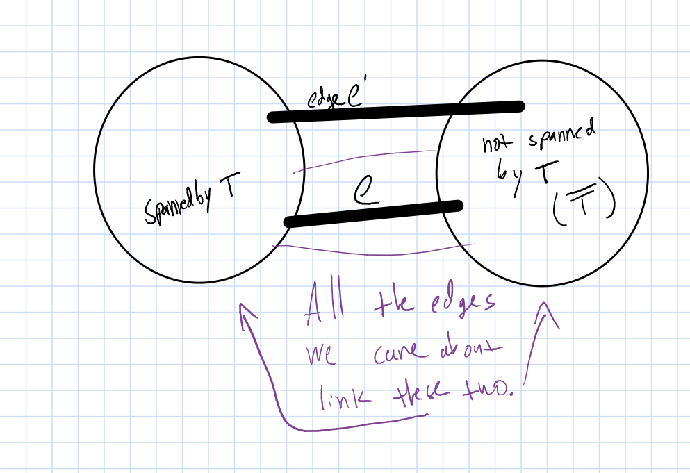
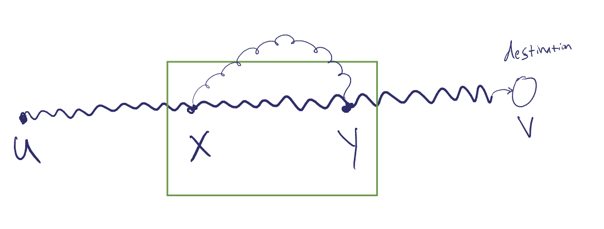
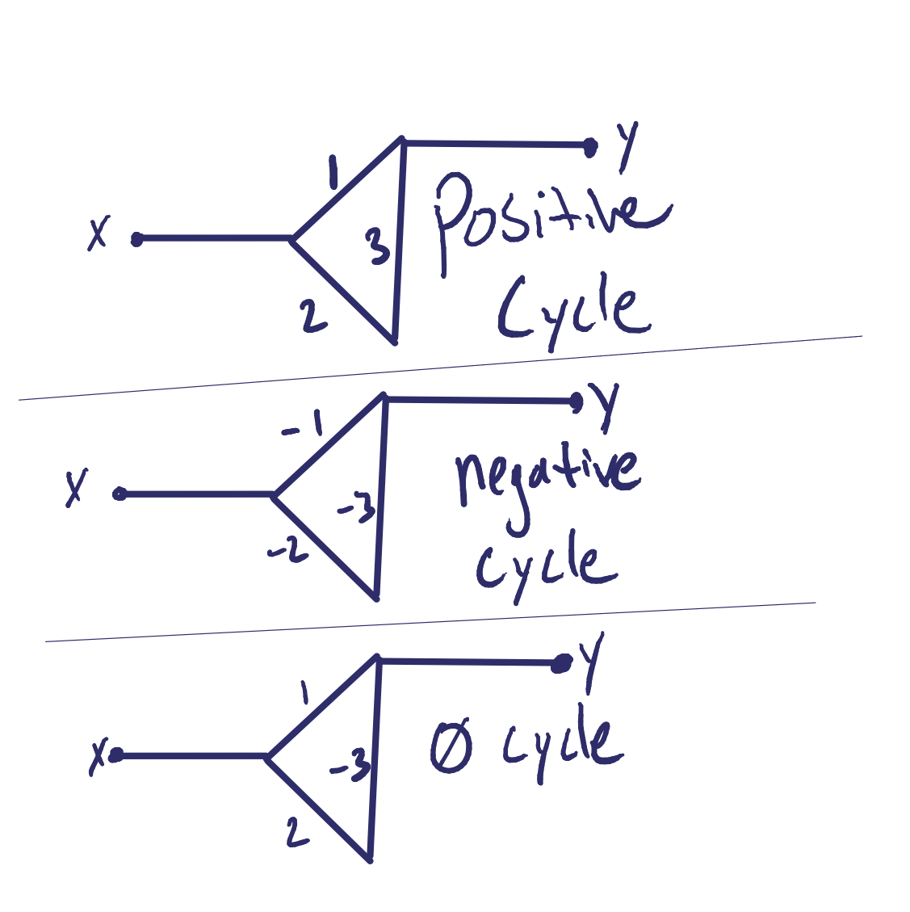
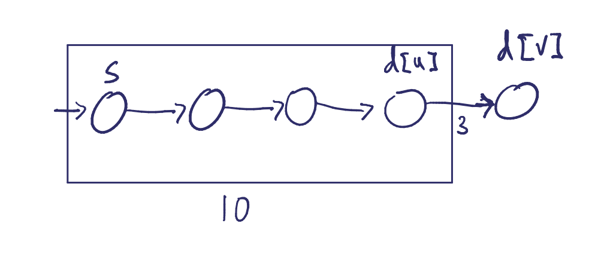
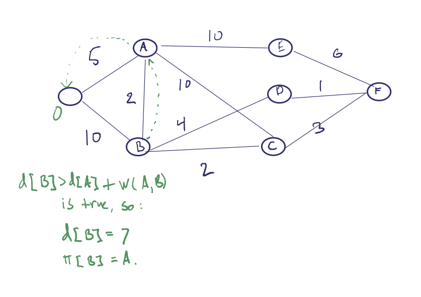

### 5/21/13

# This Week:

*   Shortest path
*   Network flow (Chip Martel on Thursday)

* PS7 is out
* PS5 are graded
* Filkov's OH canceled on wed the 22nd

# Why can MST be solved by greedy?
#### Given: Unrirected, weighted raph `G`, with _distinct edge_ weights

### Thm: Given a partial MST `T` and the rest of the nodes, the cheapest edge not in `T` is in every MST of `G`

### Pf: Let `e` be the cheapest edge from `T` to `~T`. So `e` is greedy's choice. but let `e'` be in _opt_ instead. `T` and `~T` must be connected since we are talking about spanning tree.  Therefore `e'` must be between `T` and `~T`.

# Shortest Paths:

### A `path` from x to y in an undirected, weighted graph G (v_1, v_2, v_3, ..., v_n) v_0 = x, v_n = y and (v_i, v_i+1) are in E.

find a path which minimizes the sum from i to n of (w(vi,vi+1))

## Variants:

### Single source shortest path
* find shortest path from `S` (source) to all other vertices

### Single destination shortest path
* find SPs from all vertices to `d`(destination)

### Path SP
* given `x`, `y` in `V`, find the SP between them.

### All pairs SP
* produce a table for the shortest path for all `S` and `d` in `V`.

## Properties of solution to SPs

Let this show a shortest path between `u` and `v` in `G`. and let `x`, `y`, be some vertices on it.  Then the path `x -> y` is a shortest path. (by the cut and paste argument)

### Can there be cycles in the SP from x to y in G?

* note that SP algorithms are undefined with negative cycles, since the shortest path is to cycle arbitrarily long, then continue on the path.  We ignore those and cycles of 0 total weight.

## Algorithms for Single Source Shortest Path:

### Bellman Ford:

    Init(G, S)
        d[v] <- inf for all v in V.
        π[v] <- NIL for all v in V.
        d[s] <- 0

    Relax(u, v, w)
        if d[v] > d[u] + w(u, v)
            d[v] <- d[u] + w(u, v) // update edge.
            π[v] <- u //set v's prev to u.
<break>

    BellmanFord(G, S)
        Init(G, S)
        for i <- 1 to (|V| - 1)
            for each (u, v) in E
                Relax(u, v, w)

### Runtime: |V|^3

## Thm Bellman Ford:
### Pf: By induction
We assume the following is true for all `j < i`.
(*) When we are finished with iteration `i`, d[]s are correct for all vertices with longest path's from `S` not longer than `i` hops.

(I) It holds for `i = 1`.

By assumtption, it holds for i = j.

Now we prove for i = j + 1:

`d[v_i+1] = d[v_1] + w(v_i, v_i+1)`

if the relaxation is done, or

`d[v_i+1] <= d[v_i] + w(v_i, v_i+1)`

otherwise.

# Dijkstra

uses a priority queue, Q. where vertices are keyed by their d values.

    Init(G, S)
    S = Ø
    Q = V
    while Q not empty:

 dijkstra and network flow next time.

- - -

