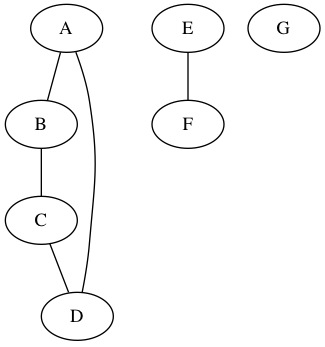

# Lecture proposal notes for Wed, 5/15/13 - Bryan Maass

Plan:
----
1. DAG review
* Topological Sort (Top Sort)
* Strongly Connected Components
* MST
* Questions ( prepare for hw 5/6 questions )

Directed Acyclic Graphs
---


Quick DFS Review
--

- - -


Topological Sort
----
### Def:
#### The topological sort of a dag `G = (V, E)` is a linear ordering of all its vertices such that if G contains an edge `(u,v)`, then `u` appears before `v` in the ordering. (If the graph contains a cycle, then no linear ordering is possible.)


```
1. call DFS(G) to compute finishing times v[f] for each vertex v in G
2. as each vertex is finished, insert it onto the front of a linked list
3. return the linked list of vertices
```

* hand-wave correctness during example
* consider what happens when cycle

Minimal Spanning Tree
---
### Def: Spanning Tree
Given a connected, undirected graph ->

a tree that connects all the vertices together. A single graph can have many different spanning trees.

### Def: Minimal Spanning Tree
We can also assign a weight to each edge, which is a number representing how unfavorable it is, and use this to assign a weight to a spanning tree by computing the sum of the weights of the edges in that spanning tree. A minimum spanning tree (MST) or minimum weight spanning tree is then a spanning tree with weight less than or equal to the weight of every other spanning tree. More generally, any undirected graph (not necessarily connected) has a minimum spanning forest, which is a union of minimum spanning trees for its connected components.


Strongly Connected Components
---

```
1.  call DFS(G) to compute finishing times u[f] for each vertex u
2.  compute Gt = Transpose(G)
3.  call DFS(Gt), but in the main loop of DFS, consider vertices in order of decreasing u[f]
    (as computed in line 1)
4.  output the vertices of each tree in the depth-first forest formed in line 3 as a separate
    strongly connected component
```


