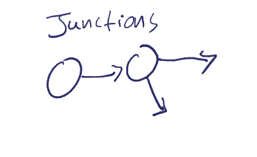
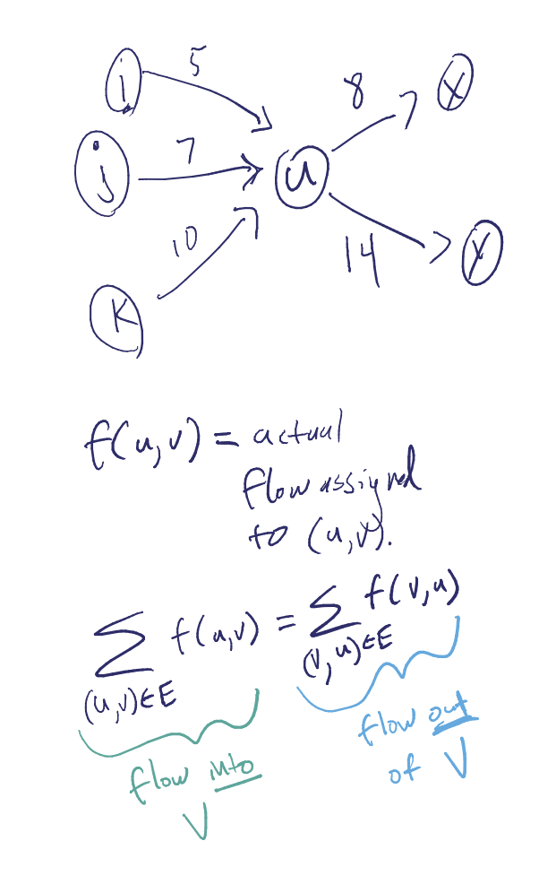
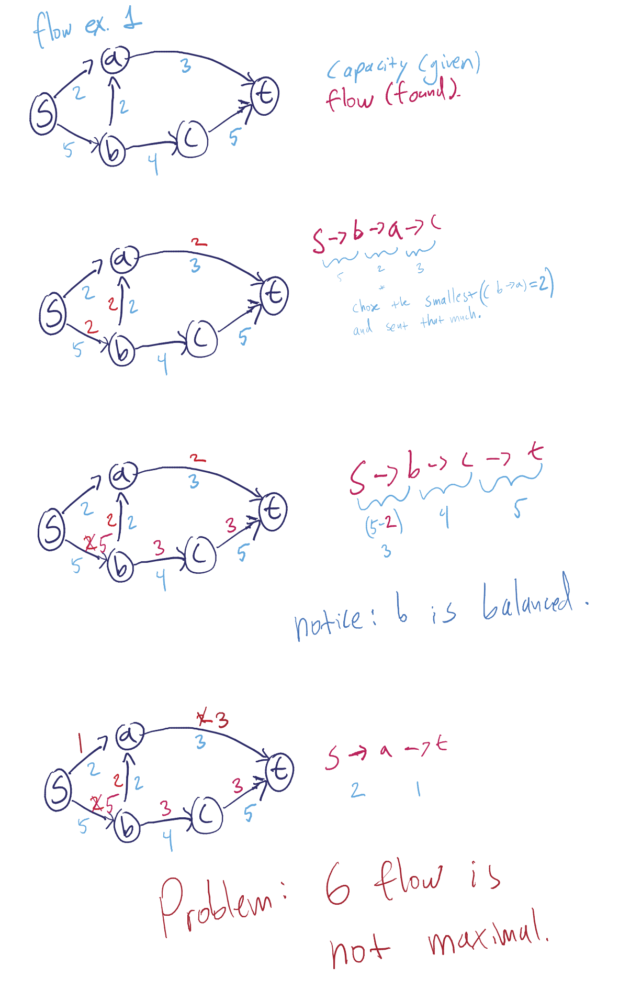
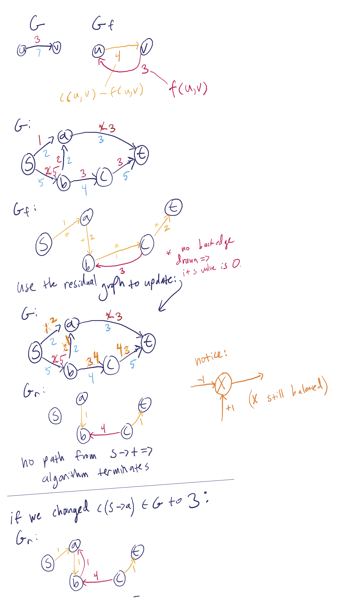
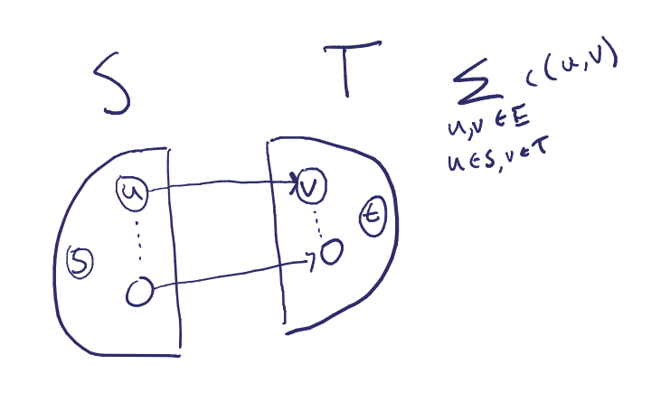

## 5/23/13

Guest lecture by professor Charles (Chip) Martel.

Lecture Videos Lec 13 (starting at minute 52) & 14.
found at: www.cs.ucdavis.edu/~martel/122a

# Ch 26 - Network Flow

Imagining networks as (computers / transportation / power / water), we can think of arcs as having something flowing through it.

### 26.1 - setting
*   Directed Graph G = (V, E)
*   arcs represent capacity : `c(e) > 0` meaning: `c(u, v) > 0`
*   flow is less than or equal to capacity: `0 <= f(u,v) <= c(u,v)`
*   source node `s`  (in V)
*   terminal (sink) `t`   (in V)

Find a flow that sends the most from s to t.

Flow conservation: for each node s.t. `v != (s or t)`,

Flow value v(f): `total flow out of s` = `flow into t`.

#### Residual Graph: `G_f`

Augmented Path: Path `s -*-> t` in `G_f`, `c_f(p)` = min value on arcs in p so we augment by this amount.

### 26.2 - Ford Fulkerson Algorithm (network flow)

    Start with any legal flow f (f = 0 usually)
    Form G_f
    While there exists an augmenting path, p in G_f // a path from s -> t.
        Augment the flow by c_f(p)  // updates f
        Form new G_f

Notice O(|E|) per iteration of the while loop.

number of iterations is O(|E|^2 * |V|).

Also, if all c(e) [capacities] are integers, then the flow is as well.

So, how can we improve our runtime?

## S, T cut
Partition of V into S, T: s in S, and t in T.

Capacity of the cut = `the sum of all capacities of edges from S to T`

Flow across cut = (`the flow from S -> T` - `the flow from T -> S`)

~

#### For any cut S,T:
max flow <= `c(S, T)`

when FF stlops, we have the final flow f, and `G_f` has no path to T.

We let

    S* = all vertices reachable from S in `G_f`
    T* = rest

~

f(u,v) = c(u,v)
