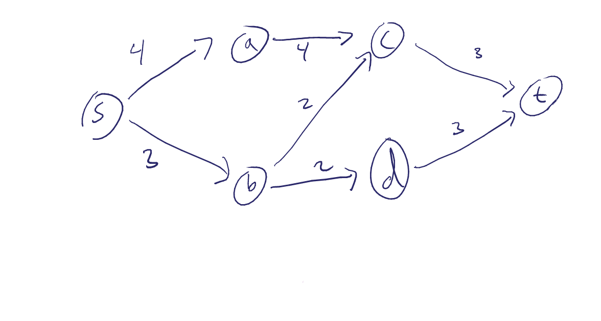
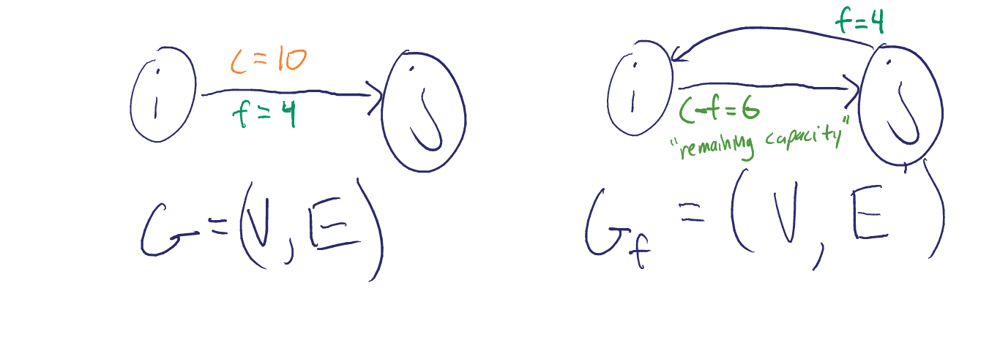
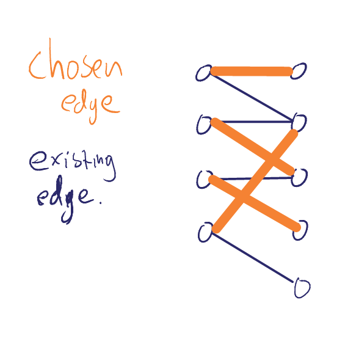
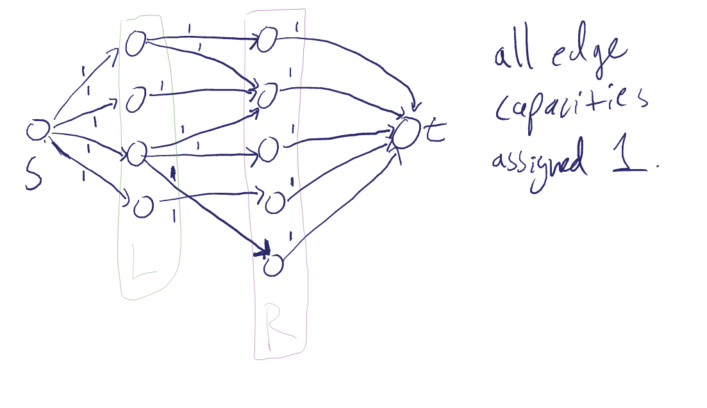
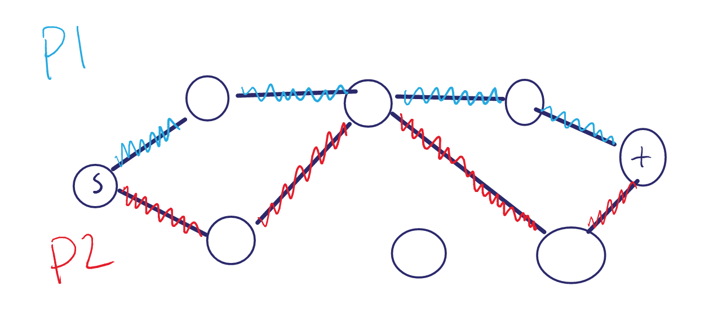

## 5/28/13

# Network Flows Revisited

### Directed graph `G = (V, E)`, with `s`, and `t` in `V`, and each edge has capacity `c(e)`

## Goal: Assign flow on each edge `f(e)`

### legal flow:
i) 0 <= `f(e)` <= `c(e)`

ii) all `v` != `s`,`t` the flow into `v` must be equal to the flow out of `v`.

#### Residual graph:

    C = c_f(f) = min c_f(i, j)

##### Augment (improve flow) by:
* adding C to the flow. (along forward edges)
* subtracting it from back edges.

## Ford-Fulkerson algorithm

    1.  Start with any legal flow f
    2.  Form G_f
    3.  While there is an augmented path in G_f
    4.      Improve the flow f using p
    5.      Update G_f

# Ch. 26.3 Applications of network flows
## Bipartite Matching

Matching - set of edges s.t. no vertex of these edges touches two edges.

Maximal Matching - a matching of highest cardinality.

### Goal: Given a bipartite graph `G = (B, E)` find a *maximal matching*.
Use network flows:

Transform the undirected `G` into a network flow graph `G'`.
* add `s` and `t`
* connect `L` and `R` nodes to `s` and `t` as shown
* direct the edges in `G`.
* assign capacity of 1 to every edge
`O(|V| + |E|)`

Solving the Network Flow problem with `G'`, as input will result in max-flow equal to the size of the maximal matching.

Why?

- No vertex in the max flow touches two edges, for otherwise we would have unbalanced flow around some vertex.

- Maximal matching: otherwise we could have sent more flow from 3.

### Runtime Analysis:
# of iterations of FF <= `O(|R| + |L|) = O(n)`

Edge Disjoint Paths

given a directed `G = (V, E)`, with `s`, `t`, in V, find two edge disjoin paths `P_1` and `P_2`, `s~~>t`.

Notice we're able to use network flow to solve this example by running `FF` for exactly two iterations.

Now, if we run `FF` on `G` we'll get `K = maxflow`.  `K` is the number of disjoint paths in `G`.

