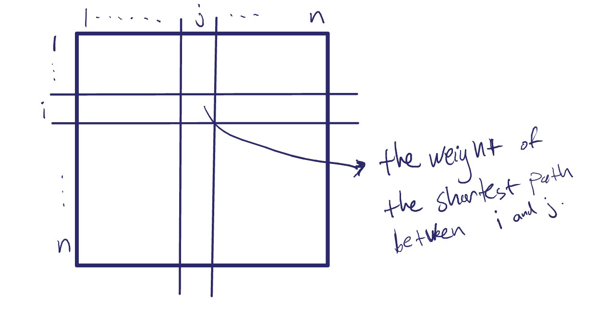
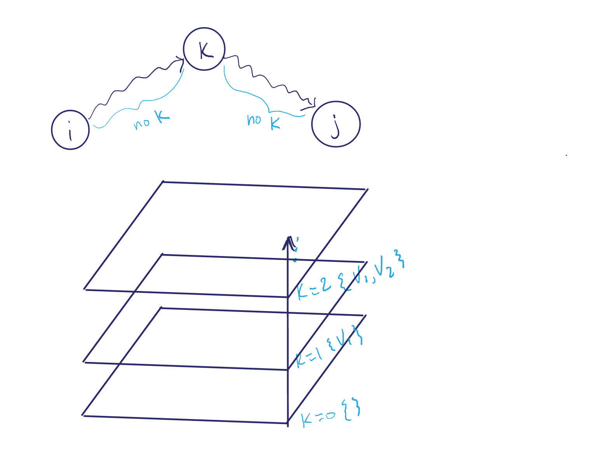

## 5/28/13

# All-pairs Shortest paths, Ch. 25

We want to make this:

### Here are some ways to make the distance matrix:

1. Use Dijkstra with all vertices as sources `O(V^2 * log(v))` for sparse graphs, `O(V^3 * log(v))` for dense.
2. Bellman-Ford with all vertices as sources `O(V^4)`
3. Floyd-Warshall algorithm `O(V^3)`

## Floyd-Warshall

- Adjacency matrix representation of `G`, an `n x n` matrix, with entries `w[i][j]`
- Output distance matrix `d[i][j]` = weight of shrotest path `i~~>j`.

Use a DP approach, where we will calculate, bottom up, the shortest path from any `j` to any other `i`. `(i, j in V)`

While using only vertices from `{1, 2, ..., k}` in `V` as intermediary vertices on `i~~>j`.

Consider then sp(i,j,k) the shortest path i~~j through `{1, 2, ..., k}`

This path may:
- include k as an intermediate node on a short path.

                {   w[i][j] if k = 0
    d(i,j,k) =  {   min(d(i,j,k-1), d(i,k,k-1) + d(k,j,k-1))

## algorithm

    1.  n <- rows(w)
    2.  D[0] <- W
    3.  for k <- 1 to n
    4.      D[k] <- d[i][j] of (k-1)
    5.      for i < 1 to n
    6.          for j <- 1 to n
    7.              d[ijk] <- min(d[i][j][k], d[i][k][(k-1)], d[k][j][(k-1)])
